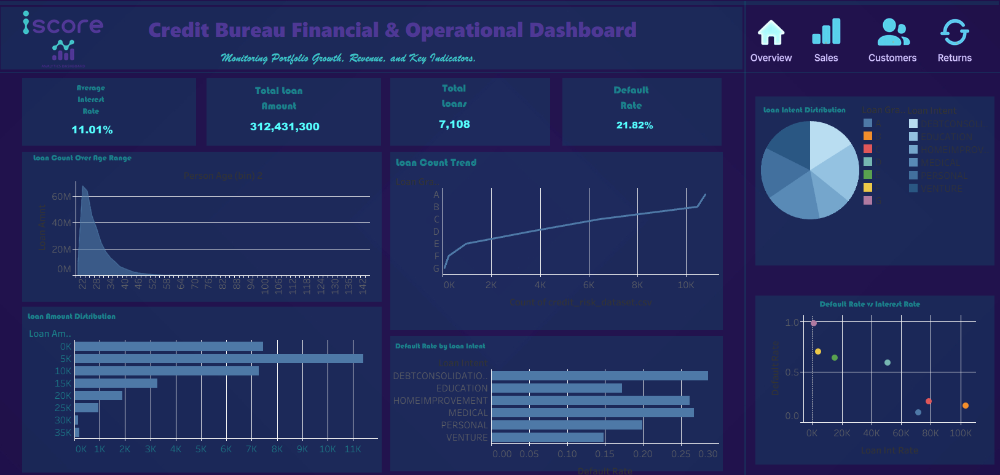
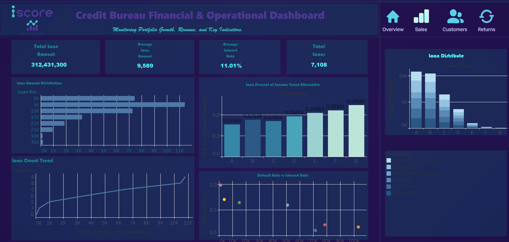
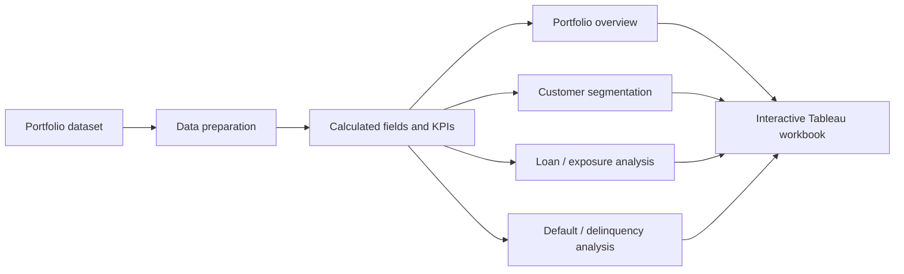

# Credit Risk Tableau Dashboard — Legacy Portfolio

> **Legacy / not recruiter-featured:** the repository name is historical. This is an independent portfolio project and is not affiliated with any employer or credit bureau. The active recruiter path uses newer clean-room synthetic projects.

Interactive Tableau portfolio project focused on credit-bureau-style reporting, portfolio segmentation, delinquency monitoring, and risk-oriented data storytelling.

> **Portfolio note:** this project uses the public `credit_risk_dataset.csv` dataset published by Lao Tse on Kaggle under CC0/Public Domain terms. Workbook metadata was re-audited on 2026-09-26 and points to that public dataset schema. No employer, bureau, or confidential customer dataset is required by this project.

## What the project demonstrates

- structuring credit-style data for business intelligence,
- defining portfolio and delinquency KPIs,
- building multi-page Tableau dashboards,
- cohort / customer / loan / default segmentation,
- interactive filtering and drill-down,
- translating risk information into an executive-facing dashboard.

## Dashboard preview

### Portfolio overview

### Customer view

### Default analysis

### Sales / portfolio view

## Live dashboard

The repository retains a GitHub Pages wrapper for historical reference:

**[Open the live Tableau dashboard](https://mrwanahmedx.github.io/iScore-Dashboard/)**

The packaged workbook is retained as a historical artifact. Its source metadata points to the public CC0 credit-risk dataset documented in `DATA_PROVENANCE.md`; it is not used by the active clean-room risk portfolio.

## Analytical structure

## Questions the dashboard is designed to answer

- What does the portfolio look like at a high level?
- Which segments contain the most borrowers or exposure?
- Where are delinquency / default concentrations visible?
- How do customer and loan characteristics differ across views?
- Which areas deserve deeper risk investigation?

The dashboard is descriptive. It supports exploration and reporting; it is **not** a bureau score, underwriting policy, or lending decision engine.

## Repository structure

| Path | Purpose |
| --- | --- |
| `iScore.twbx` | Tableau packaged workbook |
| `index.html` | GitHub Pages Tableau embed |
| `Screenshots/` | Dashboard preview images |
| `README.md` | Project documentation |

## Tech stack

- Tableau Public / Tableau Desktop
- Tableau calculated fields and dashboard interactions
- HTML + Tableau JavaScript embed
- GitHub Pages

## Related engineering case study

The newer **Data Observatory / Credit Risk Lab** expands the credit-risk theme into a web-first Python + SQL + model-validation case study with synthetic data, explicit grain controls, anti-fan-out SQL, calibration, threshold analysis, and automated tests.

**[Open the iScore Credit Lab](https://mrwanahmedx.github.io/data-observatory/score.html)**  
**[View Data Observatory source](https://github.com/mrwanahmedx/data-observatory)**

## Limitations

- portfolio / public-style data rather than official bureau data,
- descriptive dashboard rather than predictive underwriting,
- no claim of regulatory approval or real-world lending validity,
- dashboard screenshots and workbook are presented for portfolio demonstration.

## Author

**Marwan Ahmed**  
[LinkedIn](https://www.linkedin.com/in/mrwan-ahmed/) · [GitHub](https://github.com/mrwanahmedx)
